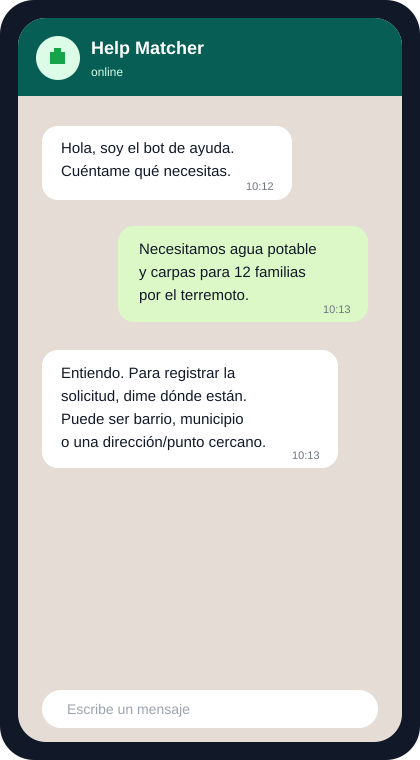
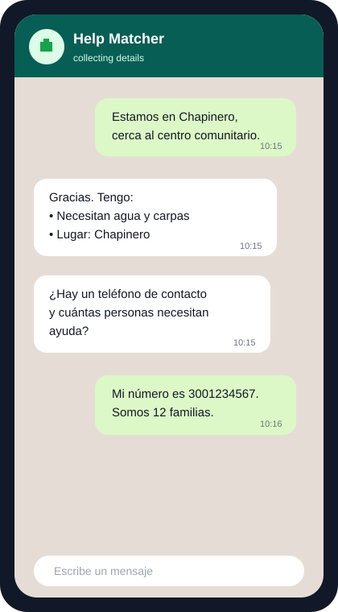
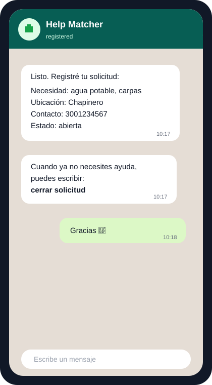

# Help Matcher

FastAPI/Postgres backend and LLM WhatsApp bot/interface to match earthquake-relief demand/supply. Allow people offering help and people needing help to find each other easily, without adding admin overhead on forms/apps/etc. Using an WhatsApp LLM bot people can interface with the system and tell us what they're offering/need and the backend will log that. Goal is to provide a webinterface to allow people to search for offers/demands and get in contact with each other that way. I would also love to have an auto-matching system in there that automatically suggests to people who could help them or who they could help straight away.
And making AI generated images they can post on social media to get attention is also a nice feature.

## Run locally

```bash
poetry install
cp .env.example .env
poetry run serve --reload
```

Database connection settings are built from `POSTGRES_USER`, `POSTGRES_PASSWORD`, `POSTGRES_HOST`, `POSTGRES_PORT`, and `POSTGRES_DB` in `.env`. `DATABASE_URL` can still be set as an explicit override when needed.

## Docker

```bash
cp .env.example .env
docker compose up --build
```

Docker Compose uses the same `.env` values for both the `postgres` service and the API configuration. Inside Compose, the API overrides only `POSTGRES_HOST=postgres` so it can reach the database container by service name.

## Admin users

Create a local admin account with:

```bash
poetry run create_admin --username test --password test
```

Use `--update-existing` to reset the password for an existing admin.

## API

- `POST /users`, `GET /users/{id}`
- `POST /auth/admins` to create an admin with username/password and receive a bearer token
- `POST /auth/login` to login with JSON username/password
- `POST /auth/login/form` to login with OAuth2 form data, used by Swagger's Authorize button
- `POST /auth/oauth-identities` to link an admin user to an OAuth provider subject
- `POST /auth/oauth-token` to login using an already-verified OAuth provider subject
- `POST /tags`, `GET /tags`, `GET /tags/autocomplete?q=med`
- `POST /offers`, `GET /offers`, `GET /offers/{id}`, `POST /offers/{id}/close`
- `POST /demands`, `GET /demands`, `GET /demands/{id}`, `POST /demands/{id}/close`
- `GET /webhooks/meta/whatsapp` for Meta webhook verification
- `POST /webhooks/meta/whatsapp` for signed WhatsApp webhook payloads

OpenAPI docs are available at `/docs`.

Tags are stored as a reusable global catalog and linked many-to-many to offers and demands. Offer and demand create payloads still accept simple tag-name lists; missing tags are created automatically. `GET /tags/autocomplete` prioritizes tags that start with the query, then includes tags that contain it.

The OAuth provider is an enum with these values:

| Provider | Subject value |
| --- | --- |
| `local` | The admin username stored in this backend. |
| `google` | The stable Google user ID, normally the verified ID token's `sub` claim. |
| `meta` | The stable Meta user ID/app-scoped ID returned by Meta after token verification. |

Provider-specific redirect flows and token verification are intentionally not implemented yet; the caller must verify the third-party OAuth token before calling `/auth/oauth-token`.

Admin-only endpoints use the OAuth2 bearer token dependency. Add this to a FastAPI route decorator to protect new routes:

```python
from fastapi import Depends
from help_matcher.auth import require_admin

@router.get("/admin-only", dependencies=[Depends(require_admin)])
def admin_only_endpoint():
    ...
```

## WhatsApp bot Python interface

Example help-request conversation:

| Initial request | Follow-up details | Registered demand |
| --- | --- | --- |
|  |  |  |

Bot code should import the small function API from `help_matcher.whatsapp`:

```python
from help_matcher.whatsapp import (
    close_demand,
    close_offer,
    complete_conversation,
    create_demand,
    create_offer,
    extract_text_messages,
    get_or_create_conversation,
    record_bot_reply,
    reply_to_message,
    save_conversation_state,
)
```

The create functions automatically create a regular user when the WhatsApp BSUID is unknown. The close functions only close records owned by that BSUID.

Use `extract_text_messages(webhook_payload)` to normalize incoming Meta webhook text messages. Use `reply_to_message(incoming, "message")` to reply to a specific incoming message through Meta's WhatsApp Cloud API. Replies require `META_ACCESS_TOKEN`, `META_PHONE_NUMBER_ID`, and `META_API_VERSION` in `.env`.

LLM bot code can keep multi-turn state in `Conversation` records:

```python
incoming = extract_text_messages(webhook_payload)[0]
conversation = get_or_create_conversation(session, incoming)

# Ask follow-up questions while the LLM gathers enough fields.
conversation = save_conversation_state(
    session,
    conversation,
    current_step="ask_location",
    collected_data={"tags": ["water"], "original_message": incoming.text},
    llm_context_summary="User needs water; location is still missing.",
)
reply = "En que barrio o direccion necesitas ayuda?"
reply_response = reply_to_message(incoming, reply)
record_bot_reply(session, conversation, text=reply, meta_message_id=reply_response["messages"][0]["id"])

# Once complete, create the record and mark the conversation complete.
create_demand(session, whatsapp_bsuid=incoming.from_bsuid, original_message=incoming.text, tags=["water"])
complete_conversation(session, conversation)
```
